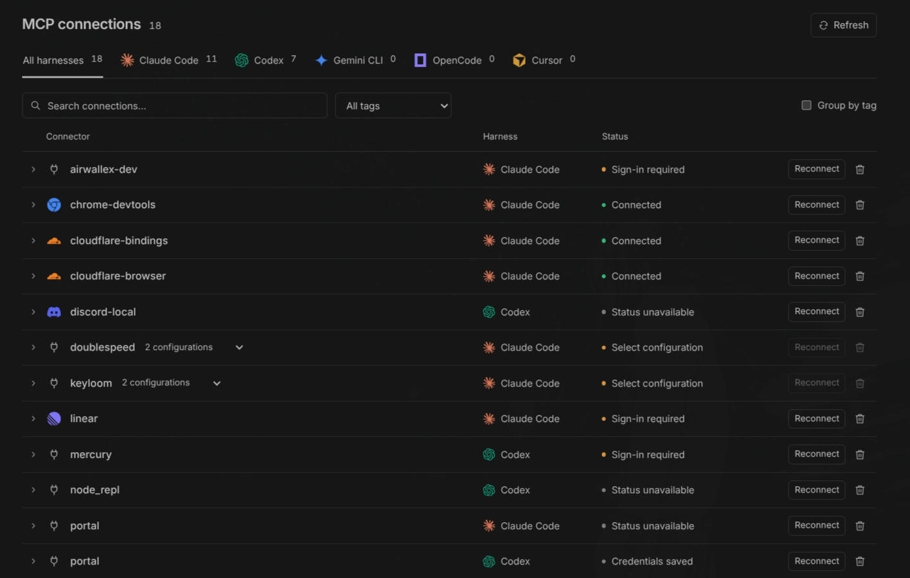

<p align="center">
  
</p>

<h1 align="center">Manage MCP</h1>

<p align="center"><strong>Your MCP connections, across harnesses, inside BB.</strong></p>

<p align="center">
  
  
</p>

<p align="center">
  
</p>

Claude Code, Codex, Gemini CLI, OpenCode, and Cursor each keep their own MCP configuration. Manage MCP brings those connections into one list so you can find them, organize them, and reconnect when needed.

## Install

```sh
bb plugin install git:https://github.com/sankalpaacharya/bb-manage-mcp.git
```

Then open **MCP inventory** in the sidebar. Requires BB 0.43+ and an enrolled host.

## What you get

- See configured MCPs across five harnesses
- Filter by harness, or search by name and tag
- Expand a row to edit tags with the pencil icon
- Group connections by tag
- Reconnect through the harness, using the host’s browser where supported
- Remove a connection with confirmation and a config backup

Same-name connections share a row within each harness. Pick a configuration before reconnecting or deleting when there’s more than one.

Checks run at startup and on **Refresh**. Claude Code reports connection status; Codex reports saved credentials. Other harnesses need native status checks. [Configuration and status details](docs/configuration.md).

## CLI

```sh
bb manage-mcp list
bb manage-mcp list --json
```

Lists configured connections without running live status checks.

## Settings

```sh
bb plugin config manage-mcp
```

| Key            | Default      |
| -------------- | ------------ |
| `hostId`       | Primary host |
| `projectPaths` | None         |

Set `projectPaths` to include project configurations: absolute paths, one per line, up to 20 folders. Click **Refresh** after changing settings.

## Dev

```sh
npm ci
npm run typecheck
npm test
npm run build
bb plugin install . --yes
```

`npm run preview` creates an interactive preview with sample data. See [CONTRIBUTING.md](CONTRIBUTING.md) for contribution guidelines.
